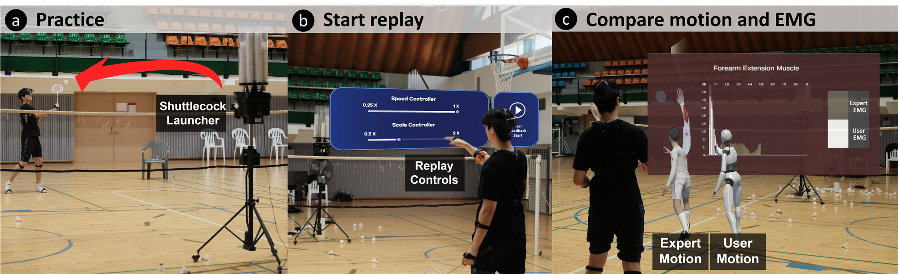
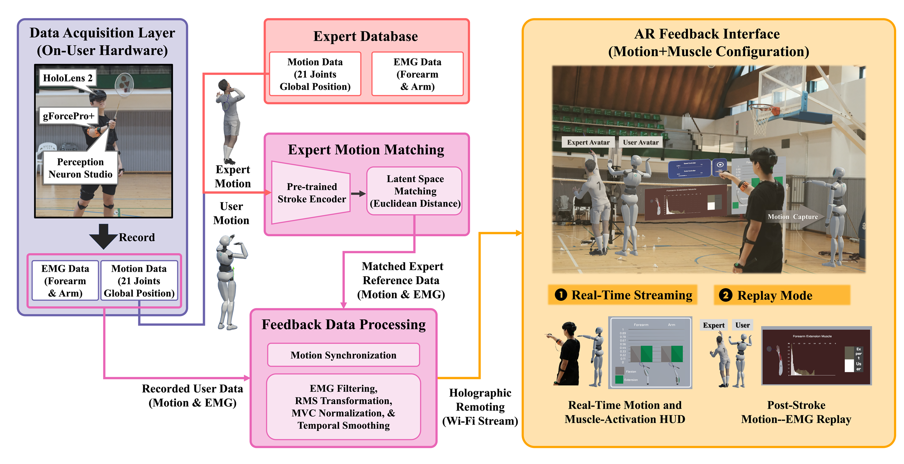

# IMPACT: An Integrated Muscle-Posture Augmented Reality Coaching Tool for Static-Stance Badminton Practice

IMPACT is an augmented-reality system for self-directed static-stance badminton practice with physical racket--shuttle contact. It combines full-body motion capture and upper-limb electromyography (EMG) sensing with expert-reference retrieval, a real-time muscle-activation display, and post-stroke motion--EMG replay.

During replay, IMPACT compares a player's recorded stroke with a kinematically matched expert reference. The accompanying study examines the bundled Motion+Muscle configuration, which adds EMG-based muscle-activation information to motion guidance through a real-time HUD and synchronized replay.



*IMPACT records a player's motion and EMG, retrieves a kinematically matched expert reference, and presents motion comparison and muscle-activation information through the AR interface.*

## Feedback configurations in the accompanying study

The accompanying exploratory study compares two AR configurations:

- **Motion-Only:** presents user and expert avatars for motion comparison and post-stroke motion replay.
- **Motion+Muscle:** adds a real-time EMG-based muscle-activation HUD and post-stroke EMG replay to the Motion-Only configuration.

## System overview



*IMPACT connects on-body motion and EMG capture with expert-reference retrieval and an AR interface for real-time muscle-activation display and post-stroke motion--EMG replay.*

## Repository contents

| Directory | Contents |
|---|---|
| `unity_project/` | Unity scene, first-party runtime and feedback source code, project settings, and MRTK package references. |
| `matching/` | Stroke-specific autoencoder matcher, deterministic retrieval server, tests, configuration, and deployed forehand-clear and backhand-drive weights. |
| `reference_data/` | Five-expert reference and matching databases derived from the public MultiSenseBadminton collection, with scripts to build the public-source materials. |
| `tools/` | Dependency installation, project preflight, matcher-launch, and public-sample preparation tools. |

## Installation and running the system

The repository excludes raw third-party Unity assets. First follow [the third-party dependency instructions](unity_project/INSTALL_THIRD_PARTY_DEPENDENCIES.md), then run:

```powershell
powershell -ExecutionPolicy Bypass -File .\tools\install_noitom_sdk.ps1
powershell -ExecutionPolicy Bypass -File .\tools\verify_unity_project.ps1
```

Open `unity_project/` in Unity `2022.3.62f3` and allow package resolution. Then open `Assets/Scenes/IMPACT_Main.unity`.

To use automatic expert matching, start the appropriate local matcher with `tools/start_matcher.ps1` before entering Play mode.

## Data scope

This repository contains the system implementation, matching model and weights, EMG-processing pipeline, public expert-reference data, and setup documentation.

The public `Assets/RecordedData/Sample/` motion and `ExpertMVC/` calibration files are replay demonstrations.

The five-expert reference database is derived from the public CC0 [MultiSenseBadminton collection](https://doi.org/10.6084/m9.figshare.c.6725706.v1). See [`reference_data/README.md`](reference_data/README.md) for the released subset, provenance, and reconstruction procedure.

The repository also excludes raw third-party avatar, anatomy, court, racket, font, chart, and device-SDK assets, as well as Unity caches, local paths, credentials, generated outputs, and hardware network settings.

## License and citation

First-party source code and distributed model weights are released under the MIT License. Third-party dependencies retain their original licenses and are not sublicensed by this repository; their installation is described in [`unity_project/INSTALL_THIRD_PARTY_DEPENDENCIES.md`](unity_project/INSTALL_THIRD_PARTY_DEPENDENCIES.md).

See [`CITATION.cff`](CITATION.cff) for citation metadata. The Zenodo DOI for the archived public `v1.0.0` release will be added here after archival.
